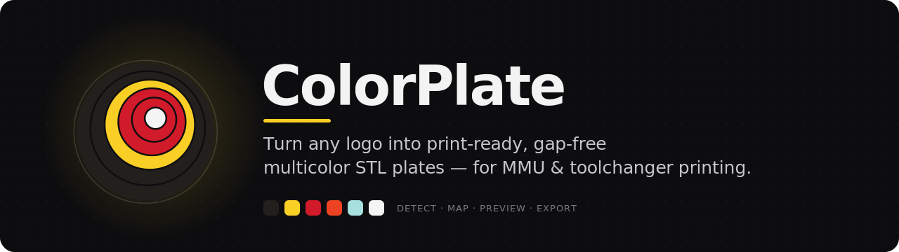
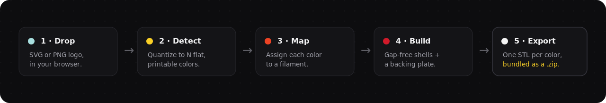
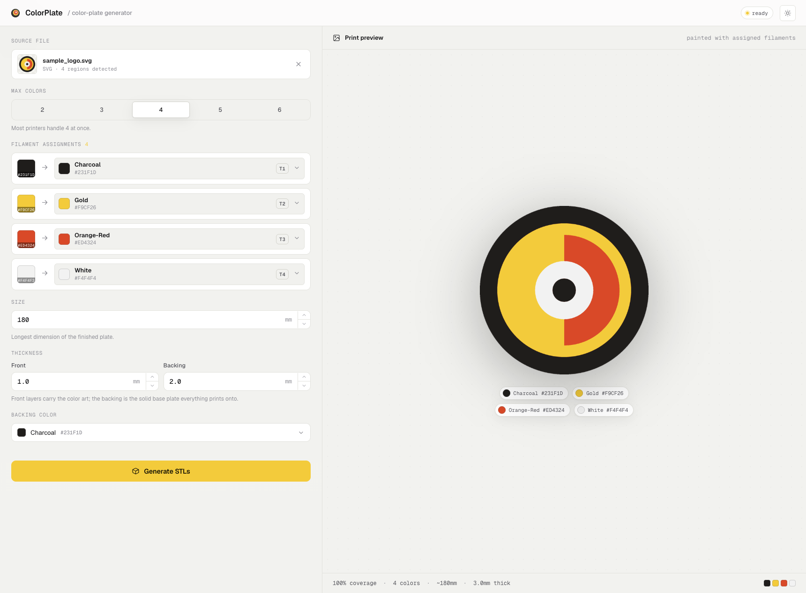
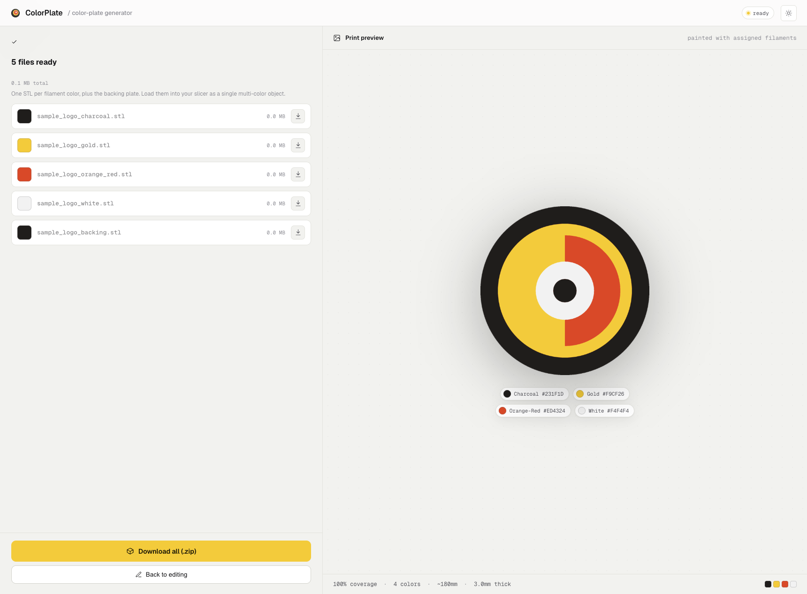
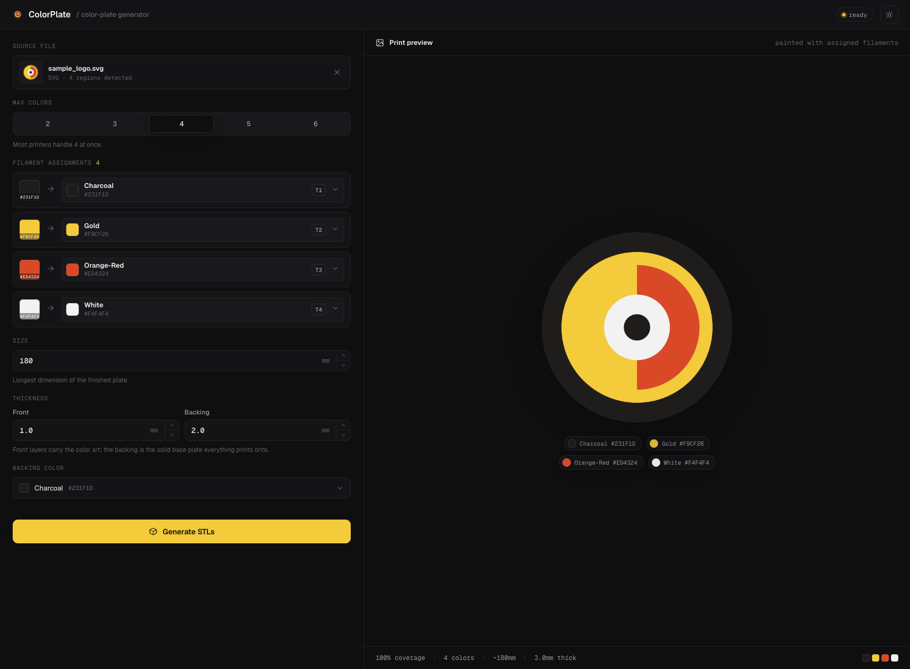

<div align="center">



<br/>

Turn SVG/PNG artwork into **layered, gap-free multicolor STL plates** for
face-down multi-material 3D printing (toolchanger / MMU).

<br/>

[](https://pypi.org/project/colorplate/)
[](https://github.com/kurenn/colorplate/actions/workflows/ci.yml)
[](https://colorplate.spoolr.io/)
[](LICENSE)
[](pyproject.toml)
[](#-web-gui)

🌐 **[Live demo](https://colorplate.spoolr.io/)** &nbsp;·&nbsp; ⚡ **[Quick start](#-quick-start)** &nbsp;·&nbsp; 🖥️ **[Web GUI](#-web-gui)** &nbsp;·&nbsp; 🛠️ **[How it works](#-how-it-works)**

</div>

---

It does what you'd otherwise do by hand in CAD: separate the artwork into its
colors, tile them so they share one plane with no overlaps or gaps, extrude a
thin colored **front shell** (the show face that prints against the bed), and
stack a single-color **backing plate** behind it so the back is one clean color.

<div align="center">

</div>

## ✨ What you get

- **Color separation, done right** — every silhouette pixel is assigned to its
  nearest palette color, so the regions *tile* with no gaps or overlaps.
- **Watertight STLs** — one clean, manifold mesh per filament color, plus an
  optional single-color backing plate so the back of the print is uniform.
- **Two ways to drive it** — a scriptable CLI and a live browser GUI, both on the
  **same pipeline** (no mocks, what you preview is what you print).
- **Slicer-ready output** — shared origin across all plates, a flat-color preview
  PNG, and a manifest mapping each color → file → RGB for toolhead assignment.

## 📸 Screenshots

<div align="center">



<em>Drop a logo — colors are detected, each maps to a filament, and the preview is painted with your real assigned colors.</em>

<br/><br/>

<table>
<tr>
<td width="50%"></td>
<td width="50%"></td>
</tr>
<tr>
<td align="center"><em>Export — one watertight STL per color, plus the backing plate, as a <code>.zip</code>.</em></td>
<td align="center"><em>Dark mode, because of course.</em></td>
</tr>
</table>

</div>

## ⚡ Quick start

```bash
pip install colorplate                 # the CLI
pip install "colorplate[auto]"         # + auto color detection for rasters (scikit-learn)
pip install "colorplate[web]"          # + the colorplate-web browser GUI
```

<details>
<summary>From source (for development)</summary>

```bash
git clone https://github.com/kurenn/colorplate && cd colorplate
pip install -e ".[web]"
```
</details>

Requires a working `cairosvg` (for SVG input) which needs Cairo system libs.

```bash
# SVG: palette auto-detected from the file's fills/strokes
colorplate logo.svg -o out/ --height 180 --backing-color c0

# Explicit, named palette (recommended for clean toolhead mapping)
colorplate logo.svg -o out/ --height 180 \
  --palette "dark=#231F1D,rim=#F9CF26,white=#FEFEFE,red=#ED4324" \
  --backing-color dark

# Raster with no known palette: quantize to N colors
colorplate art.png -o out/ --colors 4 --backing-color c0
```

### Key options

| flag | meaning | default |
|------|---------|---------|
| `--height` | longest in-plane dimension (mm) | 180 |
| `--front` | colored front-shell thickness (mm) | 1.0 |
| `--back` | backing thickness (mm) | 2.0 |
| `--backing-color` | color name for the single-color back (omit = no backing) | none |
| `--palette` | `name=#hex,...`; omit to auto-detect | auto |
| `--colors` | target colors when quantizing a raster | 4 |

## 🖥️ Web GUI

A browser front end (the ColorPlate design) drives the **same pipeline**: drop a
logo, see its colors detected, map each to a filament, set size/thickness/backing,
preview the recolored art live, and download the generated STLs as a `.zip`.

```bash
pip install "colorplate[web]"
colorplate-web                 # opens http://127.0.0.1:8000 in your browser
# colorplate-web --port 9000 --no-browser
```

> Try it without installing anything: **[colorplate.spoolr.io](https://colorplate.spoolr.io/)**

What it does (all real, no mocks):

- **Detect** — quantizes the rasterized silhouette to *up to* N colors (the "Max
  colors" selector), consolidating antialiasing fringes and folding sub-printable
  slivers into their nearest neighbor, so every region shown is actually printable.
  Each detected region is pre-mapped to its nearest filament preset.
- **Preview** — the right panel shows your *real* artwork recolored with the
  assigned filaments; it's built from the exact masks used for meshing, so what
  you see is what the STLs contain. Flip to the **3D** view to rotate the actual
  layered plates (front shells + backing) — the same geometry that gets exported.
- **Generate** — one watertight STL per distinct assigned filament (regions sharing
  a filament are merged), plus an optional single-color backing plate, a flat-color
  preview PNG, and a manifest — bundled into a downloadable `.zip`.

Endpoints live under `/api/*`; the static UI is plain React-via-Babel (no build
step). Tiny detail: auto-detection is quantization-based, so a very small distinct
color may merge into a neighbor — bump "Max colors", or use the CLI's `--palette`
for an exact named palette.

### ☁️ Deploy (Render)

The GUI + API ship as one container (`Dockerfile`), with a Render Blueprint
(`render.yaml`). Render runs a live Python process, so the whole app deploys as a
single web service — no static/host split, no CORS.

1. Push this repo to GitHub.
2. In Render: **New ► Blueprint**, pick the repo. It reads `render.yaml`, builds
   the Dockerfile, and injects `$PORT` (the app binds `0.0.0.0:$PORT` automatically).
3. Open the service URL.

Run the same image anywhere a container runs (Fly.io, Cloud Run, a VM):

```bash
docker build -t colorplate .
docker run -p 8000:8000 colorplate          # http://localhost:8000
```

Notes: the free plan (512 MB, sleeps when idle) is fine for typical logos; very
large rasters or many colors want more RAM (bump to a paid plan). Upload sessions
are held in memory on a single instance, so keep it to one instance (don't scale out).

## 📦 Output

Per run you get, in the output directory:

- `*_<color>.stl` — one watertight plate per color (front shell, z `0..front`)
- `*_backing.stl` — single-color backing (z `front..front+back`)
- `*_preview.png` — flat-color preview of the show face
- `*_manifest.json` — color → file → RGB map, for assigning toolheads

All STLs share one origin, so in the slicer: load them together, **Assemble**
into one object, assign each part a filament, and print **face-down**.

## 🛠️ How it works

```
RasterLoader   SVG -> rasterize (transparent bg) | PNG -> load + bg detect
     |         => RGBA array + silhouette mask
Classifier     assign EVERY silhouette pixel to its nearest palette color
     |         => per-color masks that tile with no gaps/overlaps
MeshBuilder    each mask -> contours (with holes) -> extruded watertight mesh
     |         scaled px -> mm, at a given thickness + Z offset
PlatePipeline  front shells at z0; backing = full silhouette behind; write files
```

Each stage is a single-responsibility class (`raster.py`, `classify.py`,
`mesh.py`, `pipeline.py`) so pieces can be swapped or tested in isolation.

## 📝 Notes

- Thin features (e.g. web strands) must be wider than your nozzle line width at
  the chosen `--height`; scale up if a preview shows hairline regions.
- The front shell must be opaque enough that the backing color doesn't ghost
  through; ~1.0 mm (5 layers @ 0.2 mm) is usually fine, bump `--front` if not.
- Source artwork must use **filled** color regions. Pure line-art (strokes only,
  colors as background showing through) needs a fill pass first.

## License

[MIT](LICENSE) © Abraham Kuri
